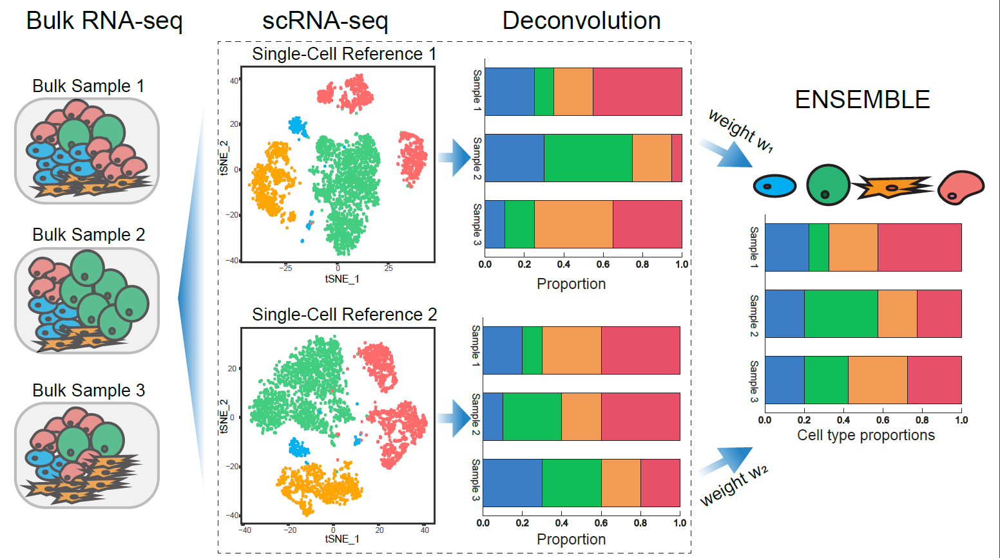

<!-- README.md is generated from README.Rmd. Please edit that file -->
SCDC: Bulk Gene Expression Deconvolution by Multiple Single-Cell RNA Sequencing References
==========================================================================================

<!-- badges: start -->
[](https://travis-ci.org/meichendong/SCDC) [](https://CRAN.R-project.org/package=SCDC) <!-- badges: end -->

SCDC is a [deconvolution](https://en.wikipedia.org/wiki/Deconvolution) method for bulk [RNA-seq](https://en.wikipedia.org/wiki/RNA-Seq) that leverages cell-type specific gene expressions from **multiple [scRNA-seq](https://en.wikipedia.org/wiki/Single_cell_sequencing) reference datasets**. SCDC adopts an ENSEMBLE method to integrate deconvolution results from different scRNA-seq datasets that are produced in different laboratories and at different times, implicitly addressing the [batch-effect](http://www.molmine.com/magma/global_analysis/batch_effect.html) confounding.



Citation
------------
Meichen Dong, Aatish Thennavan, Eugene Urrutia, Yun Li, Charles M Perou, Fei Zou, Yuchao Jiang, SCDC: bulk gene expression deconvolution by multiple single-cell RNA sequencing references, Briefings in Bioinformatics, , bbz166, https://doi.org/10.1093/bib/bbz166

License: MIT


Installation
------------

You can install the released version of SCDC from [GitHub](https://github.com/) with:

``` r
if (!require("devtools")) {
  install.packages("devtools")
}
devtools::install_github("meichendong/SCDC")
```

Dependency package problem regarding to 'xbioc' could be resolved by:
``` r
install.packages("remotes")
remotes::install_github("renozao/xbioc")
```

Vignettes
---------

Please see the [vignettes page](https://meichendong.github.io/SCDC/articles/SCDC.html).

The SCDC paper is published at [Briefings In Bioinformatics](https://doi.org/10.1093/bib/bbz166).

Questions regarding to the package can be emailed to: meichen@live.unc.edu

FAQs / Notes
------------
- When there is only 'one subject/individual' in the single cell dataset, please use `SCDC_qc_ONE()`, `SCDC_prop_ONE()` functions.

Aspects that could affect the deconvolution results:
- data format: are bulk and single cell samples both raw counts / same format? We expect the data format to be consistent and comparable.
- gene filtering: did you filter out lowly expressed genes / ribosomal genes / mitochondrial genes? These genes may affect the downstream analysis.
- cell size and library size factors: for a single cell, do you think the sum of all gene counts (the library size) could reflect its real cell size? This is one of our assumptions: the ratio of library sizes between cell types can reflect the ratio of real cell sizes between cell types. If not, you can manually input the cell size factor when constructing the "basis matrix".
- similar cell types: are there cell types that could potentially confound the analysis? For example, cell types that have very similar profiles /marker genes. 
- missing major cell types / technical issues: do you expect the sequencing procedure to make a big difference in bulk and sc even the technique is the same? Sometimes single cell reference data may lose information for some cell types. For example, there's fat cells in your bulk samples, but somehow you don't have it for single cell data.
- deconvolution using a single reference dataset: did you try to use one reference dataset to test if the results make sense generally? I see you tried Bisque. Have you tried other methods like CIBERSORTx? If results from other "one-reference" deconvolution methods make more sense, then you can input these directly using our ENSEMBLE step.

